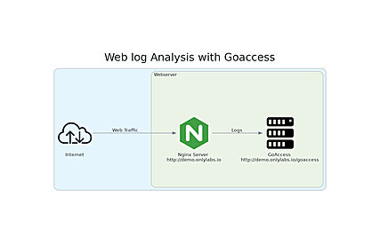

Web log analysis is the process of collecting, parsing, and examining log files generated by web servers, which record user interactions, requests, and other valuable information about a website's traffic. 

This data can provide valuable insights into user behavior, site performance, security vulnerabilities, and much more. 

### Architecture Lab
In this lab we will find a deploy of a Nginx server with a simple website for demo and a GoAccess server configured to read web logs from the website:



We will see a simulated internet traffic and analyse the metrics in GoAcces.

### Demo Website:

Open firefox browser and write the following URL:

```bash
http://demo.onlylabs.io 
```

### GoAccess Website

Open a new tab in the firefox browser  and write the following URL:

```bash
http://demo.onlylabs.io/goaccess
```