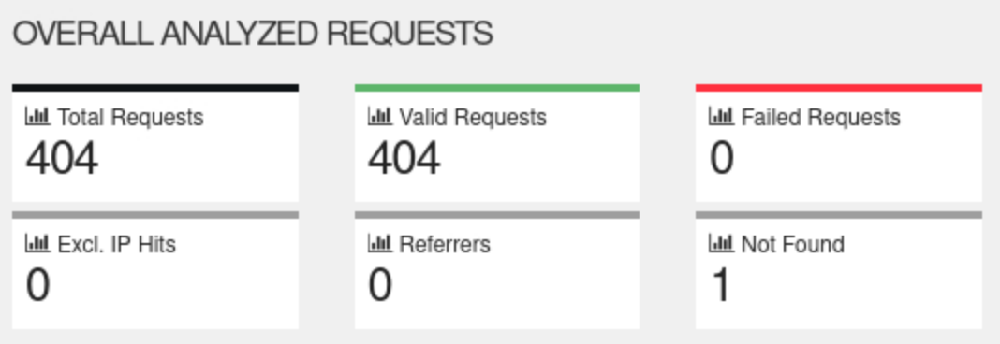
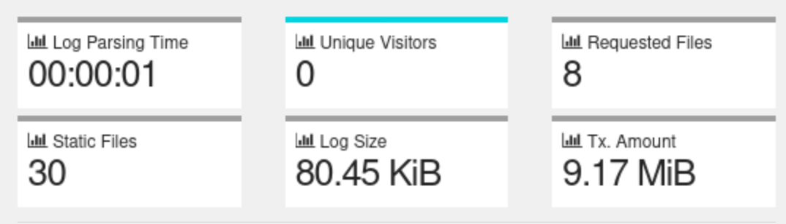

In GoAccess website you will find the follow metrics, that can provide a more comprehensive analysis of website performance and visitor behavior, allowing website owners and developers to make informed decisions about optimizing their website for better user experience and engagement.

- Total Requests: The total number of requests made to the web server.
- Valid Requests: The number of requests that returned a successful response.
- Failed Requests: The number of requests that returned an error response.
- Not Found: The number of requests that resulted in a "404 Not Found".
- Referrers: The top external websites that referred traffic to the site.
- IP Hits: The number of unique IP addresses that made requests.

- Log Parsing Time: The time taken by GoAccess to parse the web server access log file.
- Unique Visitors: The number of unique visitors to the website.
- Requested Files: The top requested files on the website.
- Static Files: The number of static files (e.g., images, CSS, JS) requested.
- Log Size: The size of the web server access log file.
- Amount: The amount of data transferred between the web server and clients.