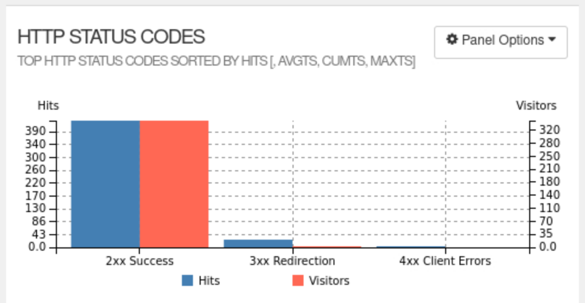

HTTP status code graphic is a visual representation of the most frequently occurring HTTP status codes in your web log data. This graphic provides a quick and easy way to identify the most common status codes, allowing you to gain insights into the performance and health of your web application

- Top HTTP Status Codes: These are the most common status codes encountered in your log data, sorted by the number of hits. The higher the number of hits, the more frequently a specific status code has been recorded.

- AVGTS (Average Time Served): This column shows the average time taken to serve requests with each specific HTTP status code. 

- CUMTS (Cumulative Time Served): This column represents the total time spent serving requests with each specific HTTP status code.

- MAXTS (Maximum Time Served): This column displays the maximum time taken to serve a single request with each specific HTTP status code. 