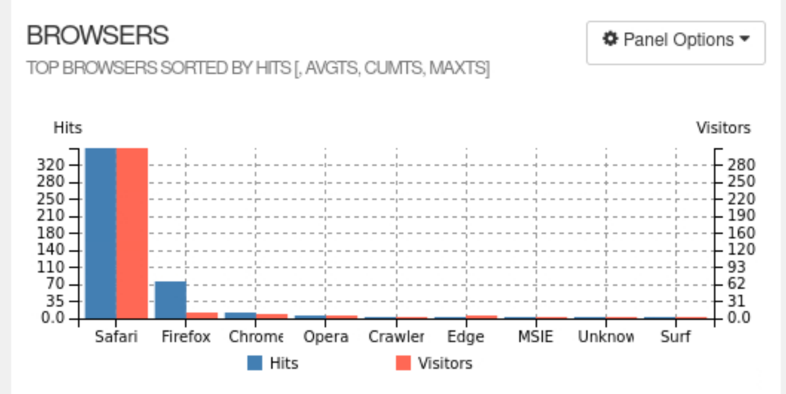
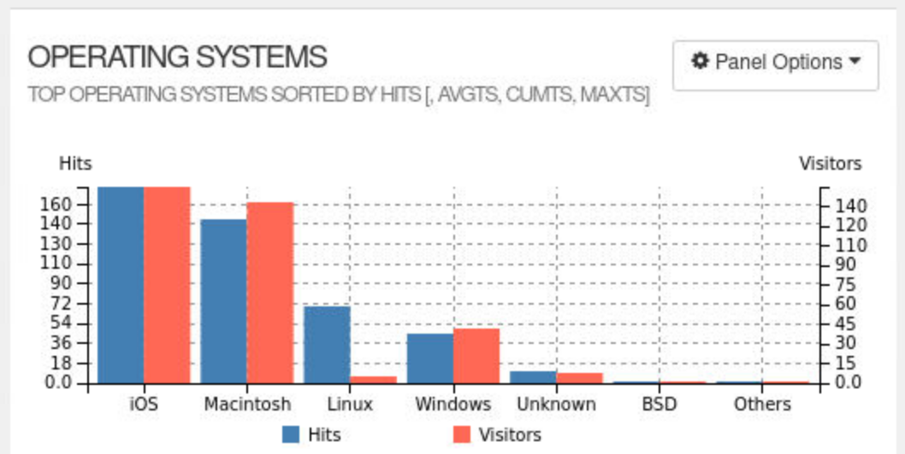

 The browsers graphic is a visual representation of the various web browsers used by visitors to access your website. This graphic provides valuable insights into the distribution of web browsers among your users, allowing you to optimize your website for better compatibility and performance across different browsers.

The operating systems graphic is a visual representation of the various operating systems used by visitors to access your website. This graphic provides valuable insights into the distribution of operating systems among your users, allowing you to optimize your website for better compatibility and performance across different platforms.
