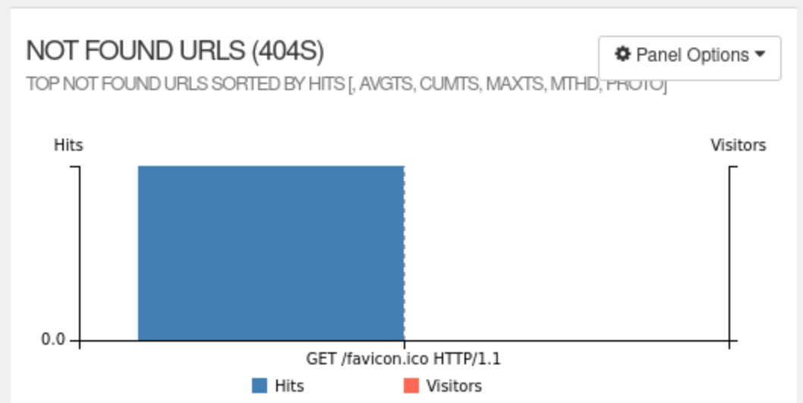
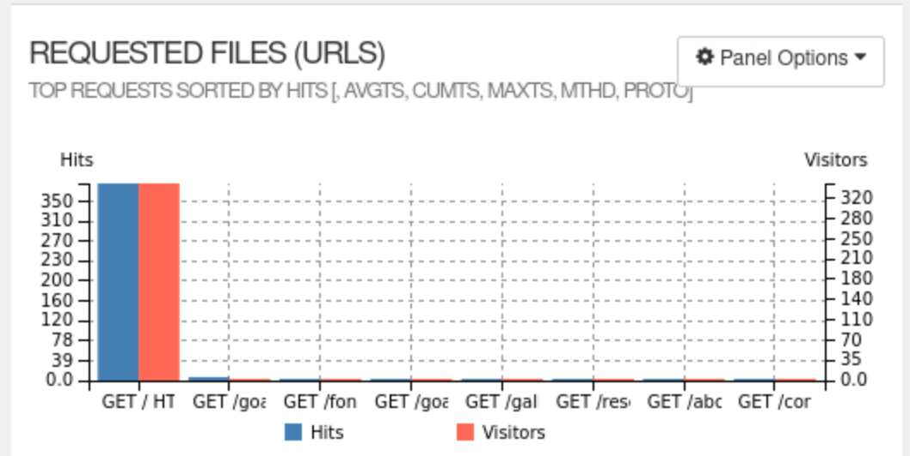

This information can be valuable for identifying broken links, missing pages, or other issues that may be preventing visitors from accessing all parts of your website. By addressing these issues, you can improve the user experience for your visitors and potentially increase engagement and conversions on your website.

This can be useful for identifying large files that may be slowing down your website. By identifying these files, you can take steps to optimize them or remove them from your website to improve website speed and performance.
