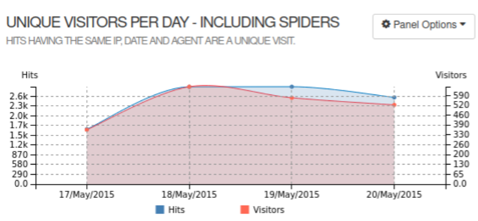
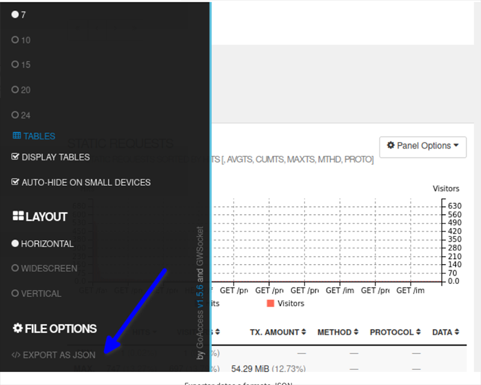

GoAccess can provide information on the number of unique visitors per day, including spiders, by analyzing web server logs. This information can be valuable for understanding the overall traffic to your website and for identifying trends and patterns in visitor behavior.

Exporting files in JSON format in GoAccess provides a powerful and flexible way to work with the data and analytics generated by the tool. By exporting data in JSON format, you can easily analyze and work with the data in other applications or tools, making it a valuable feature for data-driven organizations and businesses.
